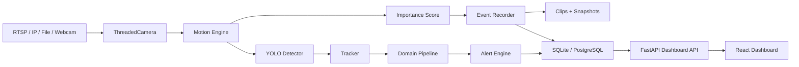

# Architecture

SmartVision is split into independent domain services that share common infrastructure.

## Service Boundaries

- `shared_core` is reusable infrastructure.
- Each top-level domain folder is independently executable with `python -m <module>.service`.
- `api_gateway` aggregates dashboard endpoints and module endpoints.
- `frontend` is a separate deployable React app.

## Storage Optimization

The motion engine filters static scenes before inference-heavy work. The recording engine uses an in-memory circular buffer, starts clips only for meaningful events, stops clips after idle timeout, and keeps JSON sidecars for fast timeline search.

## Deployment Path

Local deployments can use SQLite and webcam/video files. Edge deployments can run one or more module services per device. Cloud deployments can use PostgreSQL, containerized API/frontend services, and object storage integration for clip archives.
